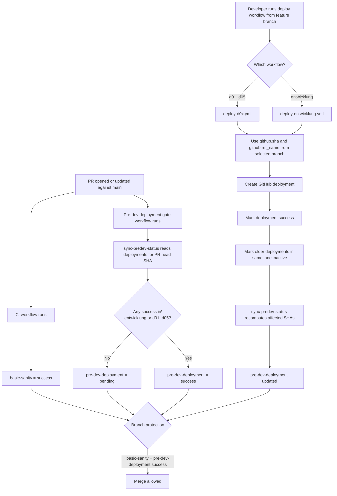
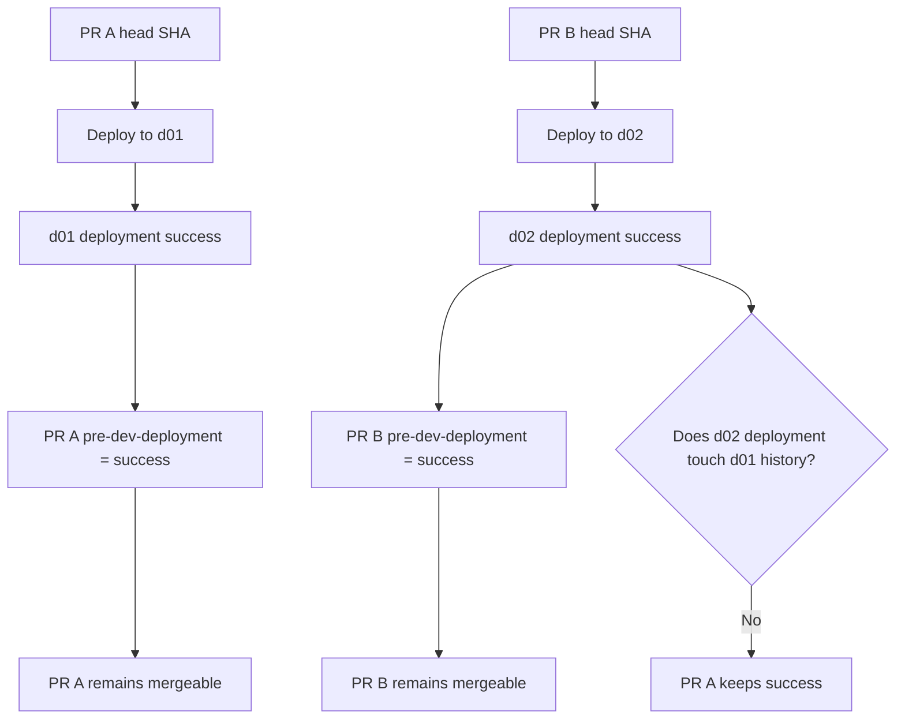
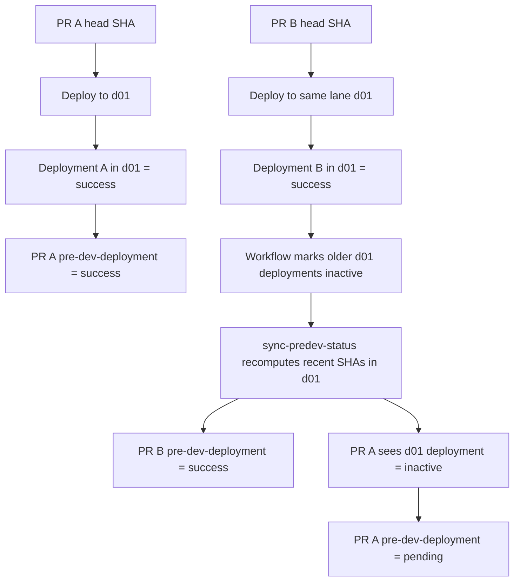
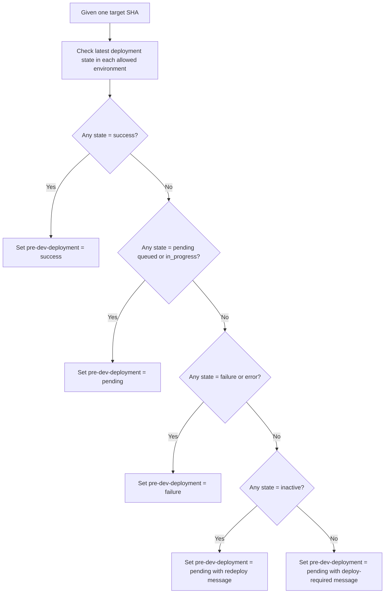
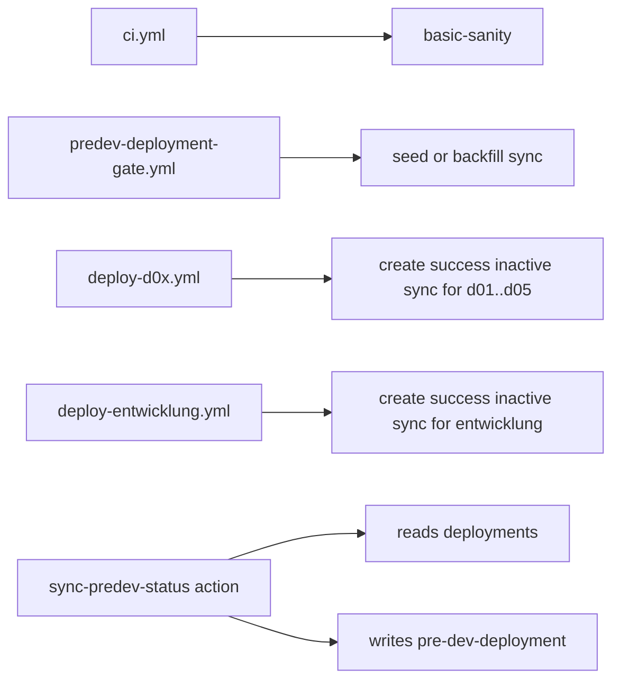

# Flowcharts

This document shows the actual execution flow in the POC, from a fresh PR with no deployment to a mergeable PR, plus the two important rewrite cases:

- different lanes: no rewrite
- same lane: rewrite happens on purpose

## Components

- `.github/workflows/ci.yml`
  - creates the required `basic-sanity` check
- `.github/workflows/predev-deployment-gate.yml`
  - seeds or backfills the required `pre-dev-deployment` status
- `.github/workflows/deploy-d0x.yml`
  - deploys the selected branch head to `d01` to `d05`
- `.github/workflows/deploy-entwicklung.yml`
  - deploys the selected branch head to `entwicklung`
- `.github/actions/sync-predev-status/action.yml`
  - reads deployment history and writes the final `pre-dev-deployment` commit status

## 1. Untouched PR -> Mergeable PR

## 2. Different Lanes -> No Rewrite

This is the main scenario the POC fixes.

Feature A deployed to `d01` must stay valid when Feature B deploys to `d02`.

## 3. Same Lane -> Rewrite Happens

This is expected behavior, not the original bug.

If two different SHAs both use `d01`, the newer `d01` deployment becomes the active one and the older one is inactivated.

## 4. State Decision Inside sync-predev-status

This is the decision tree inside `.github/actions/sync-predev-status/action.yml`.

## 5. Runtime Ownership

